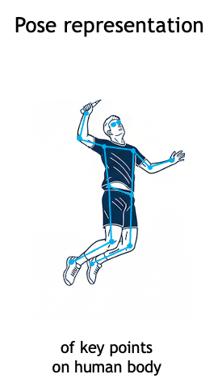

# Toward AI Coaches for Physical Activities  
### Badminton as the First Testbed

> Exploring AI-assisted coaching for physical activities, starting with **badminton** and expanding to other domains over time.  
> This repo contains pose datasets, baselines, and proof-of-concept LLM pipelines for **human-understandable motion analysis and feedback**.

---

## 0. High-Level Framing

Large language models like ChatGPT have proven to be excellent *cognitive tutors*: they explain mistakes, walk through reasoning step by step, and adapt to a learner’s level. This project asks a natural follow-up question:

> **Can AI systems coach physical activities in the same way?**

A true coaching system must do more than classify actions. It must:
1. **Observe** human movement  
2. **Understand** what is happening relative to ideal technique  
3. **Explain** its reasoning in human terms  
4. **Suggest** actionable adjustments  

Badminton serves as the first testbed for exploring this idea.

<p align="center">
  
</p>
<p align="center"><em>From observation to explanation and feedback: the AI coaching loop.</em></p>

---

## 1. Motivation & Vision

Traditional ML systems for sports focus on prediction accuracy, often at the expense of interpretability. While internal (non-human-understandable) representations are acceptable, **coaching outputs must be human-readable**.

This project explores whether **pose-centric representations + language models** can bridge that gap—producing explanations that resemble how real coaches reason about movement.

Long-term, the goal is to build **AI coaches for physical activities**, not just classifiers.

---

## 2. Why Badminton?

Badminton is an unusually strong domain for studying AI-based coaching:

- **Speed & latency:** Shuttle speeds are high; small delays matter  
- **Fine-grained actions:** Minor changes in arm angle or contact point have large effects  
- **Clear segmentation:** Rallies are well-defined by impact events  
- **Court geometry:** Lines enable approximate 3D calibration from monocular video  
- **Low intra-class variance (elite play):** Aids robust recognition  

If a coaching-oriented system works here, it is likely to generalize to other sports.

---

## 3. Why Pose?

Pose provides a compact, explainable representation of human motion:

- **Human interpretability:** Joint angles and kinematics map directly to coaching language  
- **Data efficiency:** Lower dimensionality than raw video  
- **Privacy:** No faces or appearance information required  
- **Robustness:** Less sensitive to lighting, clothing, or background  
- **Future-proofing:** Improves as cameras and pose models improve  

<p align="center">
  
</p>
<p align="center"><em>Pose as a concise, human-understandable motion representation.</em></p>

---

## 4. Dataset: VideoBadminton Pose Release

### 4.1 Source Dataset

This work builds on **VideoBadminton**, a dataset of 7k+ badminton clips labeled across 14+ shot classes.  
Paper: https://arxiv.org/html/2403.12385v1

### 4.2 Pose Extraction Pipeline

To enable pose-centric research, I release extracted pose sequences derived from VideoBadminton:

- **Player detection:** YOLO (8M) to detect people per frame  
- **Active player selection:** Two players closest to frame center  
- **Pose estimation:** COCO-17 keypoints using Sapiens (2B)  
- **Manual validation:** Active shooter verified and noisy clips cleaned  

<p align="center">
  
</p>
<p align="center"><em>Pose extraction and validation pipeline.</em></p>

### 4.3 Data Format & Availability

- Per-video pose sequences stored as CSV files  
- Metadata stored in `videoBadminton_metadata.csv`  
- Train / val / test splits provided  

**Pose CSVs:** 
The pose dataset is available in the following github folder: ['VB_DATA/'](VB_DATA)

The code for pose extractor is available in the [pose_extractor] (src/pose_extractor) folder.

If you don't want to use git, you can download form here: 
https://drive.google.com/file/d/14Ktq68uIm1I6CGAd1xHeOqgWw66stNo4/view


---

## 5. Replicating Prior Work: CNN & LSTM Baselines

To establish reference points, I replicated simple temporal baselines:

- **CNN baseline:** Frame features → temporal pooling  
- **LSTM baseline:** Pose sequences → shot labels  

Experimental setup:
- Random sample of videos  
- Shooter facing camera  
- 80/20 train/validation split  
- Hyperparameter tuning performed  

<p align="center">
  
</p>
<p align="center"><em>Pose extraction and validation pipeline.</em></p>

The code is available in the 'src/baselines/' directory.
These models achieve reasonable accuracy, but are **opaque**.

---

## 6. The Explainability Gap

While tools like SHAP can highlight influential features, they are often:
- Hard to interpret
- Poorly aligned with how coaches think
- Difficult to translate into actionable advice

This motivates a shift toward **language-based explanations**.

---

## 7. LLM / LMM-Based Evaluation: Core Idea

Instead of mapping pose → label directly, this project explores:

pose → language → label + rationale


Language becomes:
- A **debugging interface**
- A **coaching interface**
- A bridge between ML and human understanding

---

## 8. System A: PoseScript-Style Narration → LLM

**Idea:** Convert pose sequences into natural-language descriptions, then classify using an LLM.

**Pipeline**

video → pose extraction → pose narration → LLM → shot + rationale


This approach works as a **proof-of-concept**, but requires heavy prompt engineering and is not task-optimized.

---

## 9. System B: Engineered Features → Compact Coaching Text → LLM

To reduce prompt complexity, this system uses **hand-crafted biomechanical features** (joint angles, velocities, contact height) mapped to short coaching phrases:

- “High forehand contact with fast overhead swing”
- “Flat racket path at chest-height contact”
- “Split-step → lunge toward forecourt”

<p align="center">
  
</p>
<p align="center"><em>Example LLM inference with evidence and confidence.</em></p>

This yields:
- Shorter prompts
- Clearer rationales
- Easier debugging

---

## 10. Example End-to-End Inference

pose sequence
→ description generation
→ prompt construction
→ LLM inference
→ {label, confidence, evidence}

Outputs are structured JSON, explicitly tying predictions to pose-derived evidence.

An end-to-end example is available in the 'src/openAI.ipynb' notebook.

---

## 11. Current Status & Honest Assessment

**What exists today:**
- Public pose dataset
- CNN & LSTM baselines
- LLM-based proof-of-concept pipelines

**What works:**
- LLM explanations are useful and intuitive

**Limitations:**
- Significant prompt engineering required
- Limited generalization across tasks
- Not yet production-ready

This repo is intentionally positioned as **exploratory research**, not a finished product.

---

## 12. Future Directions

- Reduce prompt complexity
- Better pose summarization (PoseScript-style improvements)
- Models that natively reason over pose
- Bridging SHAP-identified features → language
- Extending beyond badminton:
  - Other sports
  - Guitar (audio + pose fusion)

This is an exciting research direction, and I hope to continue exploring it.

---

## Quickstart

### 1) Environment
```bash
# Python >= 3.10 recommended
python -m venv .venv
source .venv/bin/activate  # Windows: .venv\Scripts\activate
pip install -r requirements.txt
```

If you plan to run the LLM notebooks:
```bash
export OPENAI_API_KEY=YOUR_KEY   # or set in your shell/profile
```

### 2) Data
```
datasets/
  raw/
    video-badminton/      # original videos/labels (not included)
  poses/
    video-badminton/      # provided JSONL pose splits
```

### 3) Baselines
Open the notebooks:
- `notebooks/baselines/cnn_baseline.ipynb`
- `notebooks/baselines/lstm_baseline.ipynb`

### 4) LLM/LMM experiments
- `notebooks/llm/posescript_llm_shot_classification.ipynb`
- `notebooks/llm/customtext_llm_shot_classification.ipynb`

---

## Repo Structure
```
.
├── configs/
│   └── llm/
│       ├── posescript.yaml
│       └── customtext.yaml
├── datasets/
│   └── poses/
│       ├── video-badminton/
│       │   ├── train.jsonl
│       │   ├── val.jsonl
│       │   ├── test.jsonl
│       │   └── README.md
│       └── kaggle-badminton/          # (coming soon)
├── notebooks/
│   ├── baselines/
│   │   ├── cnn_baseline.ipynb
│   │   └── lstm_baseline.ipynb
│   └── llm/
│       ├── posescript_llm_shot_classification.ipynb
│       └── customtext_llm_shot_classification.ipynb
├── scripts/
│   ├── extract_poses.py
│   ├── lift_2d_to_3d.py
│   └── generate_text_descriptions.py
├── requirements.txt
├── LICENSE
└── README.md
```

---

## Contributing
PRs are welcome! If you:
- Have additional pose datasets to share,  
- Want to improve baselines,  
- Or have better feature→text rules,  

please open an issue or PR with a short description.

---

## License
- Code: MIT  
- Pose annotations: CC BY-NC 4.0

---

## Acknowledgements
Inspired by Paul Liu’s work: https://cs.stanford.edu/people/paulliu/badminton/  
If you spot errors or have ideas for better taxonomies, I’d love to hear them—coaching is a team sport!

---

### Notes
- **Placeholders:** Any file paths or notebooks marked as *(coming soon)* are placeholders until assets are added.  
- **Terminology:** I use **LMM** to mean large (multi)modal models and **LLM** for text-only models. In practice, the shot-classification prototypes here use **LLMs** fed with **pose-derived text**.